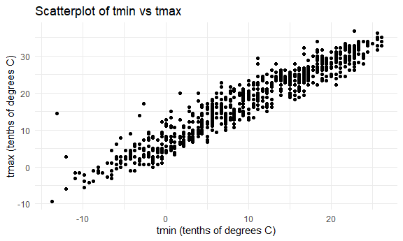
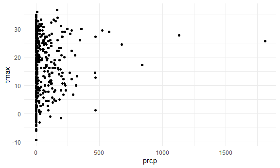
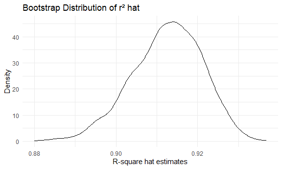
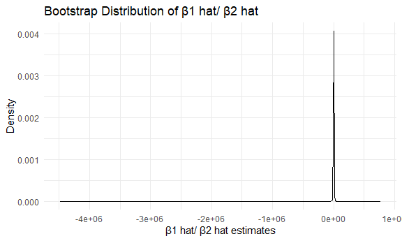
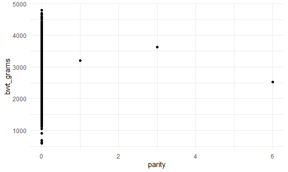
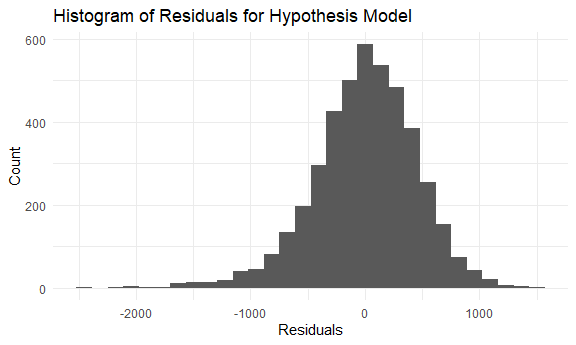
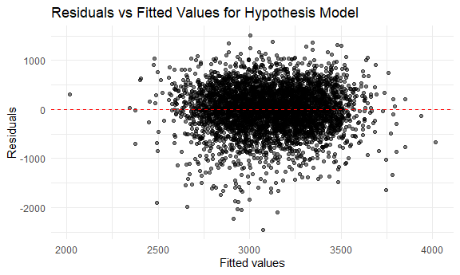
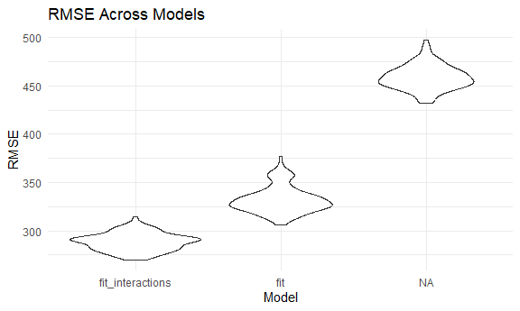

p8105_hw6_kw3180
================
Kino Watanabe
2025-11-28

# Problem 2

### Load the data

``` r
library(modelr)
library(p8105.datasets)
data("weather_df") 

weather_df <- weather_df |> 
  filter(name == "CentralPark_NY")
```

What do the distribution of variables prcp and tmin look like?

``` r
weather_df |> 
  ggplot(aes(x = tmin, y = tmax)) + 
  geom_point() 
```



``` r
weather_df |> 
  ggplot(aes(x = prcp, y = tmax)) + 
  geom_point() 
```



### Let’s do bootstrapping

``` r
set.seed(1)

bootstrap_results = 
  weather_df |> 
  bootstrap(n = 5000) |> 
  mutate(
    df = map(strap, as_tibble),
    fits = map(df, \(df) lm(tmax ~ tmin + prcp, data = df)),
    coefs = map(fits, broom::tidy),
    rsquare = map(fits, broom::glance)
  ) |> 
  select(.id, coefs, rsquare) 


coefs_tibble <- bootstrap_results |> 
  unnest(coefs) |> 
  select(.id, term, estimate) |> 
  pivot_wider(
    names_from = term, 
    values_from = estimate) |> 
  mutate(beta_slope = tmin / prcp)


rsquare_tibble <- bootstrap_results |> 
  unnest(rsquare) |> 
  select(.id, r.squared, adj.r.squared)

bootstrap_results_merged <- 
  left_join(coefs_tibble, rsquare_tibble, by = ".id")


bootstrap_results_merged
```

    ## # A tibble: 5,000 × 7
    ##    .id   `(Intercept)`  tmin      prcp beta_slope r.squared adj.r.squared
    ##    <chr>         <dbl> <dbl>     <dbl>      <dbl>     <dbl>         <dbl>
    ##  1 0001           7.63  1.04 -0.00439       -237.     0.913         0.913
    ##  2 0002           7.56  1.04 -0.00245       -424.     0.921         0.920
    ##  3 0003           7.61  1.03 -0.000690     -1492.     0.905         0.905
    ##  4 0004           7.27  1.06 -0.00290       -364.     0.921         0.921
    ##  5 0005           7.79  1.02 -0.00222       -461.     0.906         0.905
    ##  6 0006           7.54  1.04 -0.00164       -634.     0.915         0.915
    ##  7 0007           7.50  1.04 -0.00129       -808.     0.919         0.919
    ##  8 0008           7.54  1.04 -0.000428     -2435.     0.905         0.905
    ##  9 0009           7.59  1.05 -0.00145       -723.     0.917         0.917
    ## 10 0010           7.36  1.04 -0.00303       -344.     0.916         0.915
    ## # ℹ 4,990 more rows

### Plot the distribution after bootstrapping

``` r
# r² distribution
rsquare_plot <- bootstrap_results_merged |> 
  ggplot(aes(x = r.squared)) +
  geom_density() +
  labs(
    x = "R-square hat estimates",
    y = "Density",
    title = "Bootstrap Distribution of r² hat")

rsquare_plot
```



``` r
# β¹ ÷ β² distribution
slope_plot <- bootstrap_results_merged |> 
  ggplot(aes(x = beta_slope)) +
  geom_density() +
  labs(
    x = "β1 hat/ β2 hat estimates",
    y = "Density",
    title = "Bootstrap Distribution of β1 hat/ β2 hat")

slope_plot
```



- The r-square is generally normally distributed after bootstrapping,
  but the distribution of r-squares are still slightly left skewed.

- The 95% CI for the proportion of variance in Central Park’s tmax that
  is explained by predictors tmin and prcp is between 0.89 and 0.93.

- The distribution after bootstrapping for β1 hat/ β2 hat is extremely
  skewed to the left, and the wide distribution is reflected in its
  large 95% CI = (-5616.45, 4586.92). his occurs because the beta
  coefficient for prcp is close to 0, while the beta coefficient for
  tmin is close to 1. Small differences in beta 2 (prcp) lead to large
  changes in the slope ratio, making the estimate unstable.
  Additionally, precipitation shows outliers and does not appear to have
  a meaningful linear association with tmax, further contributing to
  variability in its estimated coefficient and instability in the ratio.

### 95% CI

``` r
bootstrap_results_merged |> 
  summarize(
    r2_ci_lower = quantile(r.squared, 0.025),
    r2_ci_upper = quantile(r.squared, 0.975),
    beta_ci_lower = quantile(beta_slope, 0.025),
    beta_ci_upper = quantile(beta_slope, 0.975)
  )
```

    ## # A tibble: 1 × 4
    ##   r2_ci_lower r2_ci_upper beta_ci_lower beta_ci_upper
    ##         <dbl>       <dbl>         <dbl>         <dbl>
    ## 1       0.894       0.928        -5616.         4587.

# Problem 3

``` r
library(modelr)
```

``` r
bwt_df <-
  read_csv("birthweight.csv", na = c("NA", ".", "")) |> 
  janitor::clean_names() |> 
   rename(
    baby_sex = babysex,
    baby_head_cm = bhead,
    baby_length_cm = blength,
    bwt_grams = bwt,
    mom_wt_lb = delwt,
    fam_income_hundreds = fincome,
    father_race = frace,
    gestational_age_weeks = gaweeks,
    malform = malform,
    menarche = menarche,
    mom_height_in = mheight,
    mom_age = momage,
    mother_race = mrace,
    parity = parity,
    previous_lbw = pnumlbw,
    previous_sga = pnumsga,
    mom_pp_bmi = ppbmi,
    mom_pp_wt_lb = ppwt,
    mom_smoke_per_day = smoken,
    mom_wt_gain_lb = wtgain
  ) |> 
  mutate(
    baby_sex = case_match(
                baby_sex, 
                1 ~ "Male",
                2 ~ "Female"
              ),
    baby_sex = factor(baby_sex, levels = c("Male", "Female")),
    mother_race = case_match(mother_race,
                             1 ~ "White", 
                             2 ~ "Black", 
                             3 ~ "Asian", 
                             4 ~ "Puerto Rican", 
                             8 ~ "Other"
                             ),
    mother_race = factor(mother_race, levels = c("White", "Black", "Asian", 
                                                 "Puerto Rican", "Other")),
    father_race = case_match(father_race,
                              1 ~ "White",
                              2 ~ "Black",
                              3 ~ "Asian",
                              4 ~ "Puerto Rican",
                              8 ~ "Other",
                              9 ~ "Unknown"
                              ),
    
     father_race = factor(father_race, levels = c("White", "Black", "Asian",
                                                  "Puerto Rican", "Other",
                                                  "Unknown")),
     malform = case_match(malform,
                          0 ~ "Absent",
                          1 ~ "Present"
                          ),
     malform = factor(malform, levels = c("Absent", "Present"))
    )
```

    ## Rows: 4342 Columns: 20
    ## ── Column specification ────────────────────────────────────────────────────────
    ## Delimiter: ","
    ## dbl (20): babysex, bhead, blength, bwt, delwt, fincome, frace, gaweeks, malf...
    ## 
    ## ℹ Use `spec()` to retrieve the full column specification for this data.
    ## ℹ Specify the column types or set `show_col_types = FALSE` to quiet this message.

``` r
bwt_df = 
  bwt_df |> 
  mutate(id = row_number())

# Quick check for missing values
na_counts <- bwt_df |> 
  summarise_all(~ sum(is.na(.)))

print(na_counts)
```

    ## # A tibble: 1 × 21
    ##   baby_sex baby_head_cm baby_length_cm bwt_grams mom_wt_lb fam_income_hundreds
    ##      <int>        <int>          <int>     <int>     <int>               <int>
    ## 1        0            0              0         0         0                   0
    ## # ℹ 15 more variables: father_race <int>, gestational_age_weeks <int>,
    ## #   malform <int>, menarche <int>, mom_height_in <int>, mom_age <int>,
    ## #   mother_race <int>, parity <int>, previous_lbw <int>, previous_sga <int>,
    ## #   mom_pp_bmi <int>, mom_pp_wt_lb <int>, mom_smoke_per_day <int>,
    ## #   mom_wt_gain_lb <int>, id <int>

I am aiming for a theory-driven hypothesis proposal based on published
literature. Based on “The determinants of birth weight,” they asserted,
“The results show that the sex of the baby, parity, maternal smoking
during the pregnancy, maternal height, weight, marital status, and race,
and gestation (after allowing for the foregoing characteristics) were
all important and significant factors.” Thus, I will propose a model
with `baby_sex`, `parity`, `mom_smoke_per_day`, `mom_height_in`,
`mom_wt_gain_lb`, and `mother_race` as predictors to birthweight.

[The determinants of birth
weight](https://pubmed.ncbi.nlm.nih.gov/7114129/)

### Explore data

``` r
bwt_df |> 
  ggplot(aes(x = parity, y = bwt_grams)) + 
  geom_point()
```



- There is so little variation in `parity` that it would not be a useful
  predictor. I will remove this from the model.

Hypothesized model and 2 homework-proposed models

``` r
hypothesis_fit = lm(bwt_grams ~ baby_sex + mom_smoke_per_day + mom_height_in + mom_wt_gain_lb + mother_race, data = bwt_df)

hypothesis_fit |> 
  broom::tidy() |> 
  select(term, estimate, p.value) |> 
  knitr::kable(digits = 3)
```

| term                    | estimate | p.value |
|:------------------------|---------:|--------:|
| (Intercept)             | 1087.015 |   0.000 |
| baby_sexFemale          |  -79.762 |   0.000 |
| mom_smoke_per_day       |  -12.012 |   0.000 |
| mom_height_in           |   31.968 |   0.000 |
| mom_wt_gain_lb          |   11.115 |   0.000 |
| mother_raceBlack        | -341.496 |   0.000 |
| mother_raceAsian        | -139.794 |   0.048 |
| mother_racePuerto Rican | -136.890 |   0.000 |

``` r
fit = lm(bwt_grams ~ baby_length_cm + gestational_age_weeks, data = bwt_df)

fit |> 
  broom::tidy() |> 
  select(term, estimate, p.value) |> 
  knitr::kable(digits = 3)
```

| term                  |  estimate | p.value |
|:----------------------|----------:|--------:|
| (Intercept)           | -4347.667 |       0 |
| baby_length_cm        |   128.556 |       0 |
| gestational_age_weeks |    27.047 |       0 |

``` r
fit_interactions =
  lm(bwt_grams ~ baby_head_cm * baby_length_cm * baby_sex, data = bwt_df)

fit_interactions |> 
  broom::tidy() |> 
  select(term, estimate, p.value) |> 
  knitr::kable(digits = 3)
```

| term                                       |  estimate | p.value |
|:-------------------------------------------|----------:|--------:|
| (Intercept)                                | -7176.817 |   0.000 |
| baby_head_cm                               |   181.796 |   0.000 |
| baby_length_cm                             |   102.127 |   0.000 |
| baby_sexFemale                             |  6374.868 |   0.000 |
| baby_head_cm:baby_length_cm                |    -0.554 |   0.478 |
| baby_head_cm:baby_sexFemale                |  -198.393 |   0.000 |
| baby_length_cm:baby_sexFemale              |  -123.773 |   0.000 |
| baby_head_cm:baby_length_cm:baby_sexFemale |     3.878 |   0.000 |

### Residual Diagnostics for hypothesized model

Look at residuals for hypothesized model.

``` r
bwt_df |> 
  modelr::add_residuals(hypothesis_fit) |> 
  modelr::add_predictions(hypothesis_fit) |> 
  ggplot(aes(x = resid)) + 
  geom_histogram() +
  labs(title = "Histogram of Residuals for Hypothesis Model", 
       x = "Residuals", 
       y = "Count")
```

    ## `stat_bin()` using `bins = 30`. Pick better value `binwidth`.



``` r
bwt_df |> 
  modelr::add_predictions(hypothesis_fit) |> 
  modelr::add_residuals(hypothesis_fit) |> 
  ggplot(aes(x = pred, y = resid)) + 
  geom_point(alpha = 0.5) +
  geom_hline(yintercept = 0, color = "red", linetype = "dashed") +
  labs(x = "Fitted values", 
       y = "Residuals", 
       title = "Residuals vs Fitted Values for Hypothesis Model")
```



- The first plot shows that the residuals for the hypothesized model is
  generally normally distributed, symmetric, and centered at 0. There is
  a little skewing on the left-hand size.
- The “Residuals vs Fitted Values for Hypothesis Model” is the
  diagnostic for linearity and homoscedasticity. The roughly oval and
  symmetric shape reflects that there’s more variability in residuals at
  certain fitted values (often at higher birthweights). The model’s
  linearity assumption holds, as residuals don’t show a clear trend.

### Train/test data for CV

``` r
set.seed(1)

cv_df = 
  crossv_mc(bwt_df, n = 100) |> 
  mutate(
    train = map(train, as_tibble),
    test = map(test, as_tibble)
  )

cv_df <- cv_df |> 
  mutate(
   hypothesis_fit = map(train, \(df) lm(bwt_grams ~ baby_sex + mom_smoke_per_day + mom_height_in + mom_wt_gain_lb + mother_race, data = df)),
    fit = map(train, \(df) lm(bwt_grams ~ baby_length_cm + gestational_age_weeks, data = df)),
    fit_interactions = map(train, \(df) lm(bwt_grams ~ baby_head_cm * baby_length_cm * baby_sex, data = df))
  )|> 
  mutate(
    rmse_hypothesis = map2_dbl(hypothesis_fit, test, rmse),
    rmse_fit = map2_dbl(fit, test, rmse),
    rmse_fit_interactions = map2_dbl(fit_interactions, test, rmse)
  )
```

``` r
cv_df |> 
  select(starts_with("rmse")) |> 
  pivot_longer(
    everything(),
    names_to = "model",
    values_to = "rmse",
    names_prefix = "rmse_"
  ) |> 
  ggplot(aes(x = model, y = rmse)) + 
  geom_violin()
```


